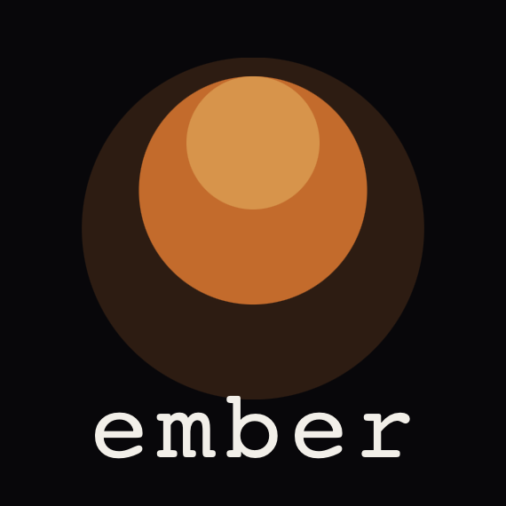

<p align="center">
  
</p>

# Ingle

**Ingle is a statically-typed, brace-delimited systems programming language** in the lineage of
C, C#, and Rust — designed to be safe without a garbage collector, fast to compile, and unusually
predictable for both humans and language models. It runs instantly on a bytecode VM, compiles to
standalone native binaries via C, and has taken its first verified steps onto bare metal. The
reference compiler is written in C with **no third-party dependencies**.

> Status: **active development** (pre-1.0). The language and its compiler are evolving together;
> expect sharp edges and breaking changes. See [MANIFESTO.md](MANIFESTO.md) for the design
> philosophy and [docs/language.md](docs/language.md) for the current reference.
>
> **Formerly Ember** — renamed Ingle in July 2026. Unrelated to Ember.js, the JavaScript framework.

Website: **[ingle-lang.org](https://ingle-lang.org)**

## Why Ingle

- **Memory-safe without a GC.** Ownership with move/borrow checking and deterministic
  reference counting — no garbage collector, no pauses, and no reference cycles by construction.
  Mutable aggregates are uniquely owned; shared values are immutable. When you genuinely need
  shared or graph-shaped data, Ingle provides blessed tools: `rc struct` (shared immutable structs)
  and `std/slotmap` (a generational arena).
- **A real type system.** Generics with bounds, enums with exhaustive pattern matching,
  `Option`/`Result` with `?`, interfaces with both static and dynamic dispatch, and zero-cost
  **newtypes** (`type UserId = int`) with **refinement types**
  (`type Percent = int where 0 <= self && self <= 100`) that turn unit/range mistakes into
  compile-time or construction-time errors.
- **Concurrency that's structured.** `nursery`/`spawn`/typed channels, running across every
  core — data-race-free because the only shared mutable state is an atomic refcount. No function
  coloring: real stack traces, safe cancellation.
- **Verification built in.** Executable `requires`/`ensures` contracts fused with an execution
  "tape", plus a static prover — a closed loop designed for an LLM to debug against.
- **Native binaries, one semantics.** The bytecode VM is the canonical reference; `inglec -o`
  emits C and links a standalone native executable of the whole language — not a subset. The
  flagship demo app (a GUI + HTTPS desktop client) compiles to a single **1.2 MB binary**.
- **The compiler compiles itself.** The full pipeline — lexer, parser, checker, codegen — is
  also written in Ingle and compiles itself; a self-built native compiler regenerates a
  **byte-identical copy of itself**. The C stage-0 compiler remains the reference oracle.
- **Reaches bare metal (early).** `inglec --emit=c --freestanding` compiles the real runtime with
  no libc and no OS underneath. A tiny Ingle kernel boots on QEMU (aarch64) with UART output,
  exception vectors, and timer interrupts — a proof of reach, not an OS. (`make test-kernel`)
- **Batteries included where it counts.** UTF-8 strings, array slices, C FFI (`extern "c"`),
  explicit-width numerics, and a standard library written in Ingle (`std/string`, `std/list`,
  `std/map`, `std/set`, `std/slotmap`, `std/http`), plus an opt-in immediate-mode graphics stack.
- **First-class editor support.** An in-tree language server (`inglec --lsp`) with hover,
  go-to-definition, completion, find-references/rename, semantic tokens, inlay hints, signature
  help, and prover verdicts — wired up for both VS Code and Zed.
- **LLM-first by design.** Structured JSON diagnostics (`--diagnostics=json`), a deterministic
  replayable tape, and the whole language shipped as one file for a model's context window:
  [ingle-lang.org/llms-full.txt](https://www.ingle-lang.org/llms-full.txt).

## Proof, not promises

A language that sells verification should be able to show its own. Each of these is a gate that
runs on every change — not a benchmark, not an aspiration:

- **1,800+ automated checks green** — golden tests, differential suites, doctor and LSP
  regressions (431 in the core suite; 1,347 in the self-hosting gate alone).
- **VM ≡ native, byte for byte** — every test program runs on both backends and the outputs
  must match exactly; drift fails the build.
- **A byte-identical fixed point** — the Ingle-written compiler, compiled to native by itself,
  regenerates its own C output byte-for-byte (N1 → N2).
- **Sanitizers + purpose-built fuzzers** — ASan and TSan clean, plus three in-house fuzzers
  attacking memory ownership, operand-width limits, and resource linearity.
- **CI on macOS and Linux**, arm64 and x86_64.

## Build

Ingle runs on **macOS and Linux** (x86_64 and arm64). The core build needs only a C17 compiler (Apple clang or gcc) and GNU Make — no other dependencies. On Linux the installer provisions the optional graphics/networking dependencies via your system package manager (apt/dnf/pacman/zypper/apk), building raylib from source where it isn't packaged.

```sh
make            # builds build/inglec
make test       # runs the golden + differential test suite
make install    # installs to ~/.ingle (inglec on ~/.ingle/bin, stdlib on ~/.ingle/std)
```

## Hello, Ingle

```ember
fn main() -> int {
    println("Hello, Ingle!")
    return 0
}
```

```sh
build/inglec --emit=run hello.ig      # run on the VM — no build step
build/inglec -o hello hello.ig        # compile a standalone native binary
./hello
```

And the same language, with the ground removed: `inglec --emit=c --freestanding` emits bare-metal
C with no libc — `make test-kernel` cross-compiles a tiny Ingle kernel and boots it under QEMU.

## Documentation

- [What is Ingle?](https://www.ingle-lang.org/what-is-ingle) — plain-language overview.
- [MANIFESTO.md](MANIFESTO.md) — the design philosophy and the decisions behind the language.
- [docs/language.md](docs/language.md) — the language reference (what runs today).
- [docs/THE_INGLE_BOOK.md](docs/THE_INGLE_BOOK.md) — the long-form guided tour
  (served as [the Guide](https://www.ingle-lang.org/guide/)).
- [docs/INGLE_FROM_THE_INSIDE.md](docs/INGLE_FROM_THE_INSIDE.md) — how the compiler works.
- [docs/architecture.md](docs/architecture.md) — compiler/toolchain engineering decisions.
- [docs/flare.md](docs/flare.md) — Flare, the declarative UI layer over the graphics backend.
- [examples/](examples/) — sample `.ig` programs.
- [llms-full.txt](https://www.ingle-lang.org/llms-full.txt) — the entire book in one file, for a
  language model's context window.

## Editor support

Extensions live under [editors/](editors/) — VS Code (`editors/vscode`) and Zed (`editors/zed`).
Both drive the same `inglec --lsp` server. The Zed syntax grammar is published separately as
[tree-sitter-ingle](https://github.com/ingle-lang/tree-sitter-ingle).

## License

Ingle is released under the [MIT License](LICENSE).

The embedded UI font (`src/font_inter.h`) is [Inter](https://github.com/rsms/inter), distributed
under the SIL Open Font License 1.1.
